# DotNetArchitecture

* Cross-Platform (Windows, Linux, macOS)
* Visual Studio 2017
* Visual Studio Code
* SQL Server 2017
* .NET Core 2.1
* ASP.NET Core 2.1
* Entity Framework Core 2.1
* C# 7.2
* SPA (Single Page Application)
* Angular 6.0.4
* Typescript 2.7.2
* HTML5
* CSS3
* SASS (Syntactically Awesome Style Sheets)
* DDD (Domain-Driven Design)
* SOLID Principles
* Dependency Injection
* Unit Test
* Unit of Work Pattern
* Repository Pattern
* JWT (Json Web Token)
* Memory Caching
* Response Caching
* Object Mapping
* Code Analysis (Ruleset for C# and TSLint for Typescript)

## Build

## Code Analysis

## Layers

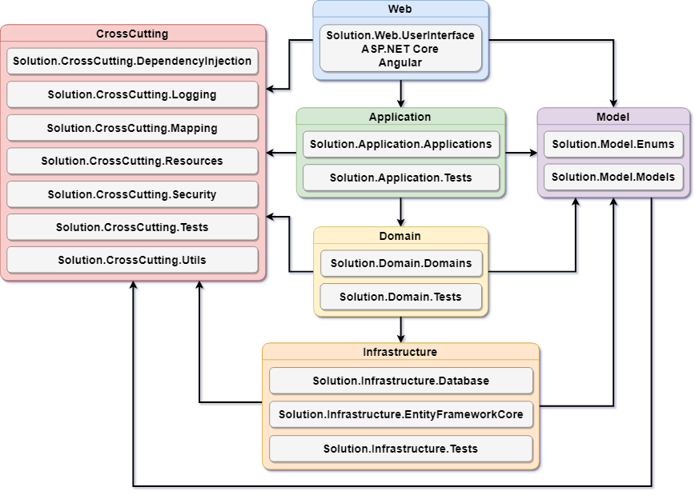

**Web:** This layer contains the user interface, responsible for interaction with the user to obtain and display data.

**Application:** This layer is the main entry point of the application, which can be ASP.NET Core, ASP.NET MVC, ASP.NET Web API, Console, Windows Service, among others.

**Domain:** This layer contains the requirements and the business logic, is the core of the application.

**Infrastructure:** This layer isolates and abstracts the logic required for data persistence.

**Model:** This layer is responsible for modeling the domain classes according with the business context.

**CrossCutting:** This layer provides generic features for the other layers.

**Tests:** It is responsible for testing individual units of the code, which can be a class, a method, an integration, a business rule, among others.

## Projects

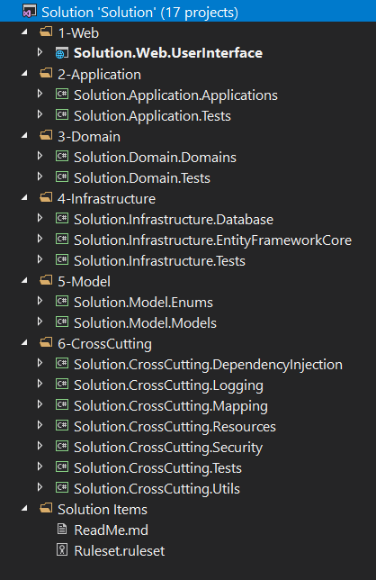

## Application

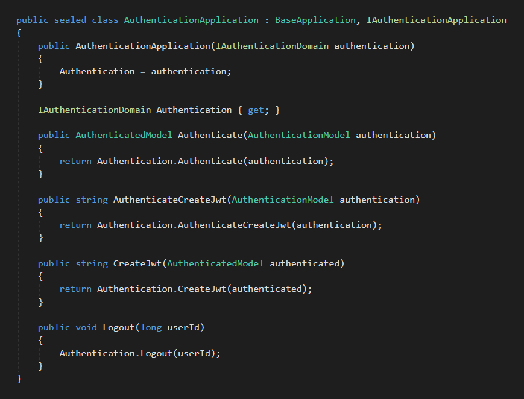

## Repository

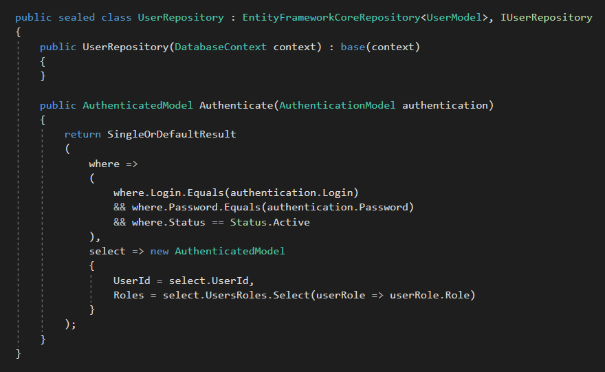

## Unit Test

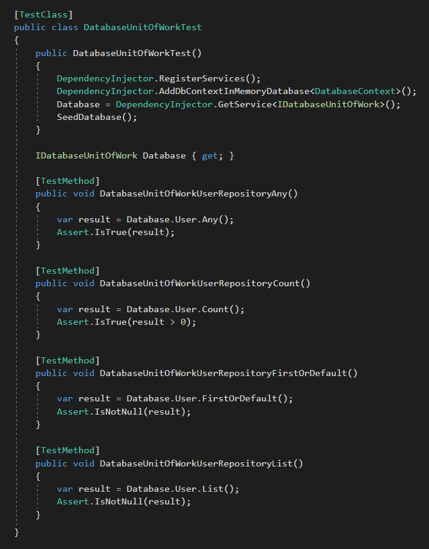

## ASP.NET Core + Angular

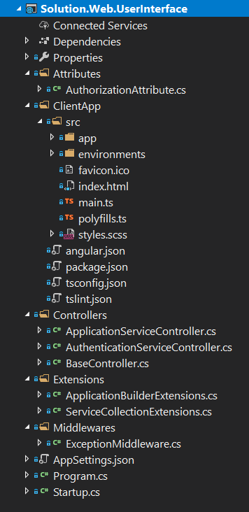

## ASP.NET Core Startup

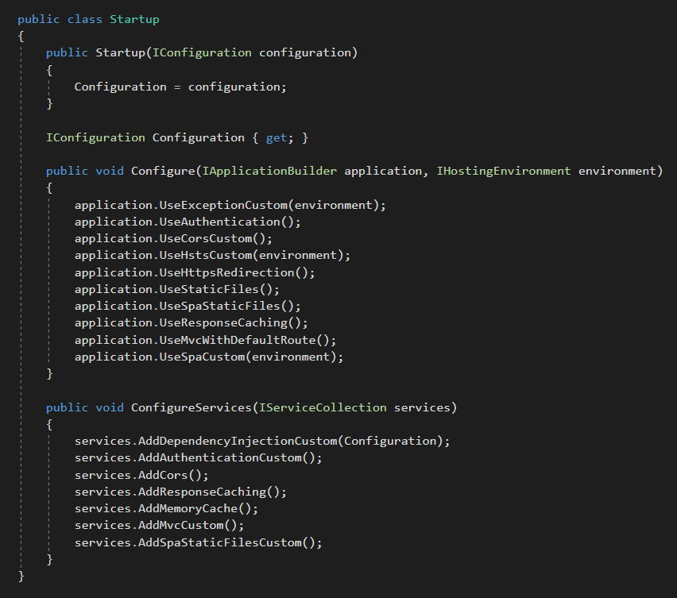

## ASP.NET Core Controller

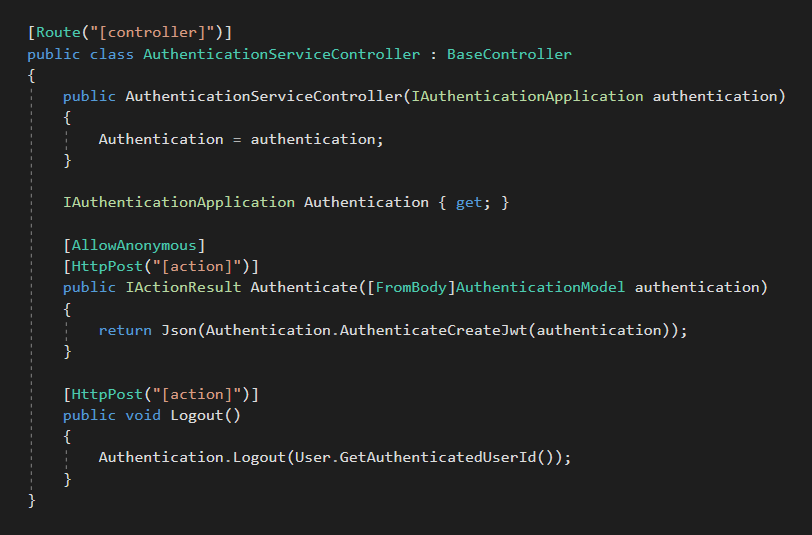

## Angular Guard

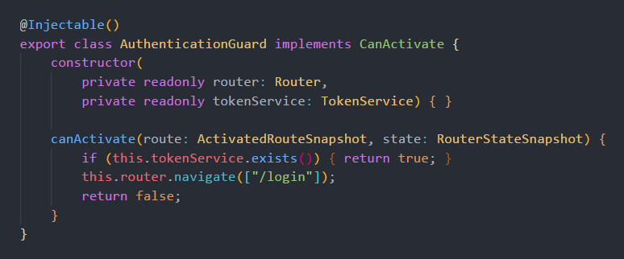

## Angular Error Handler

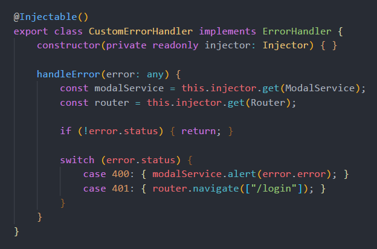

## Angular HTTP Interceptor

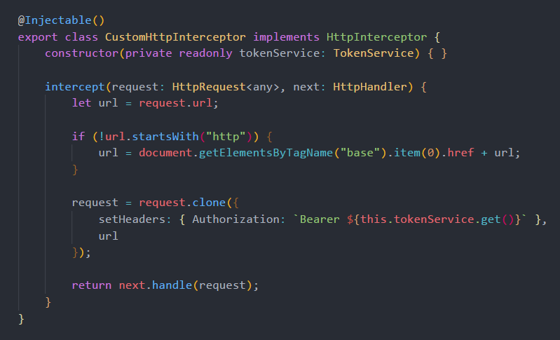

## Angular Service

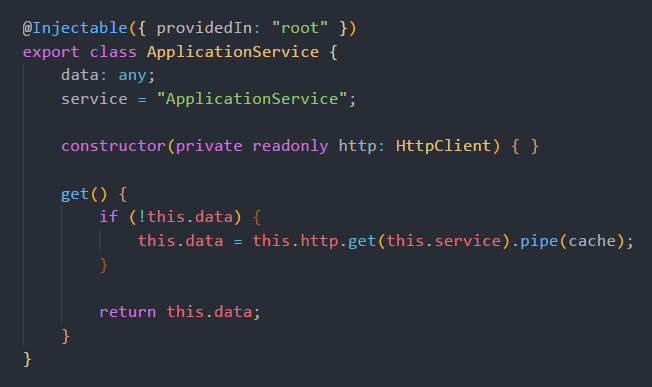

## Angular Component

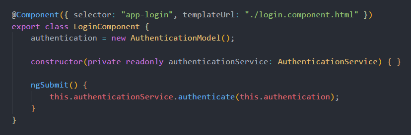

## ASP.NET Core + Angular + Entity Framework Core + SQL Server Performance

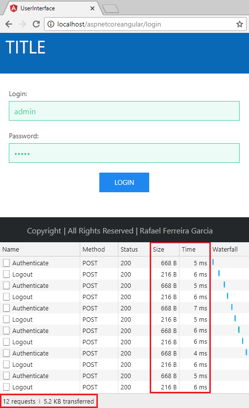

**Specifications:**

**Processor:** Intel Core I7 8700K Coffee Lake 8th-generation.

**Memory:** 16GB 2400Mhz DDR4.

**Storage:** Samsung Evo 960 SSD M2 250gb.

**OS:** Windows 10 Pro 64 bits.

**Web Server:** IIS 10.

**Database:** SQL Server 2017 Developer Edition.

## Visual Studio Extensions

**CodeMaid**: <https://marketplace.visualstudio.com/items?itemName=SteveCadwallader.CodeMaid>

**SonarLint**: <https://marketplace.visualstudio.com/items?itemName=SonarSource.SonarLintforVisualStudio2017>

**Roslynator**: <https://marketplace.visualstudio.com/items?itemName=josefpihrt.Roslynator2017>

**TSLint**: <https://marketplace.visualstudio.com/items?itemName=vladeck.TSLint>

## Run in Visual Studio Code

1. Install **.NET Core 2.1 SDK**: <https://www.microsoft.com/net/download/windows>.

2. Install **C#** extension in **Visual Studio Code**: <https://marketplace.visualstudio.com/items?itemName=ms-vscode.csharp>.

3. Open **solution folder** in **Visual Studio Code**.

4. Press **F5** to **run and fun**!

## Publish and Run in IIS

1. Install **.NET Core 2.1 Runtime**: <https://www.microsoft.com/net/download/windows>.

2. Change the **Connection String** in the **Solution.Web.UserInterface\AppSettings.json**.

3. Change the **baseHref** value to **IIS_APPLICATION_NAME** in the **Solution.Web.UserInterface\ClientApp\angular.json**.

4. Publish the **Solution.Web.UserInterface** project in the **Visual Studio** or by **dotnet publish**.

5. Copy the published files to **IIS folder** (inetpub\wwwroot\\**IIS_APPLICATION_NAME**).

6. In the **IIS** create an **Application Pool** with **NET CLR Version** = **No Managed Code**.

7. In the **IIS** execute **Convert to Application** using the previously created **Application Pool**.

8. **Run and fun!**
